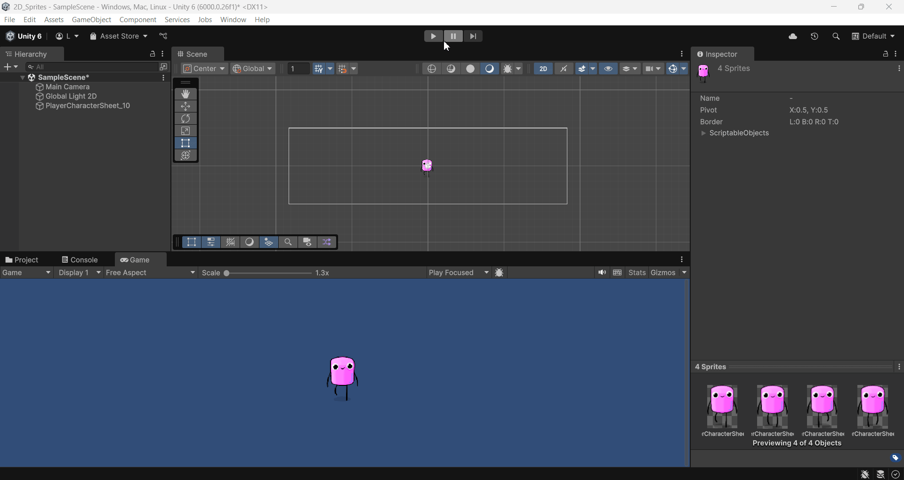
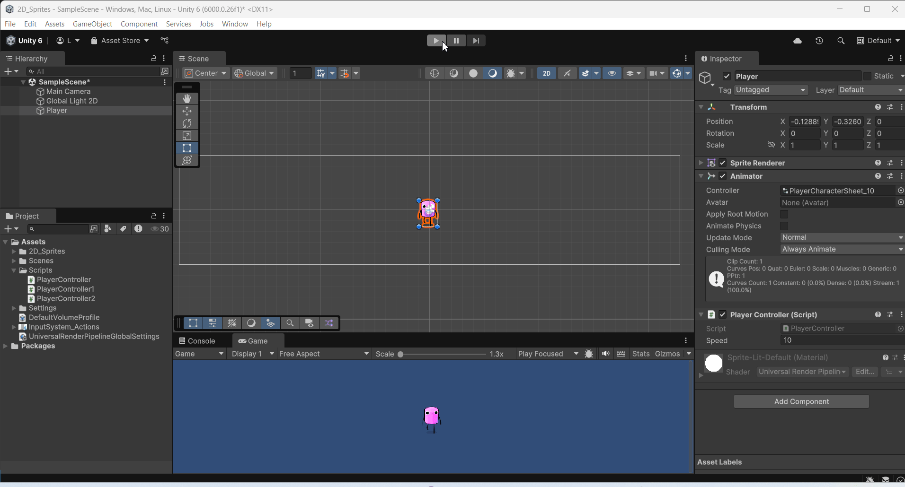

# FDV_2D_Sprites

```
>> PRACTICA:   Unity Project - FDV_2D_Sprites
>> COMPONENTE: XueMei Lin
>> GITHUB:     https://github.com/XueMei-L/FDV_2D_Sprites.git
>> Versión:    1.0.0
```

# Proceso de la practica 2D Sprites
## Actividad 1: Agregar el atlas de sprites del personaje a la escena. Configurar el sprite como múltiple y subdividirlo para tener acceso a los sprites para generar las animaciones. Agregar una de las imágenes a la escena.

## Paso 1. Crear un proyecto unity 2D


## Paso 2. Añadir el atlas de sprites y realizar la configuración
En el **[Assets]** - **[Scenes]**, realizar la configuracion en el panel de **[Inspector]**

Cambiar [sprite Mode] -> [multiple], puesto que hay varios personajes en una imagen, y [Compression] -> [None], significa que no baja la calidad de la imagen.


## Paso 3. Abrir editor de Sprite, y realizar la separación de cada personaje


En **[Slice]** selecciona **[Type]** -> **[Automatic]**, y **[Slice]**, finalmente dar a **[Apply]** y cerrar el editor.


Así ya tenmemos todos los sprites separados automaticamente, ahora añadimos uno en la escena.


## Actividad 2: Creamos un objeto 2D, arrastrando un conjunto de imágenes que selecciones al objeto añadiremos una animación. Agregar al personaje la animación “Walk Down” . Añadir otra imagen y generarle otra animación.  De esa forma Unity crea un objeto Animation, la primera vez que se crea, también añade un objeto Animator Controller.

## Paso 1. Crear animación
Seleccionar los 4 para crear la animacion walkdown con el teclado **[shift]** y arrastrar a la escena, se crea una animator y su animación.


### Resultado:



## Actividad 3-4-5: Creamos los scripts para controlar el movimiento para el personaje. Inicialmente vamos a hacer una versión sin salto. Añadir los scripts necesarios para moverlo por la pantalla. En este caso sólo tendremos que mover las coordenadas (X, Y). El movimiento de derecha a izquierda lo logramos modificando transform.position(x, y), para ello podemos usar transform.Translate(avance, 0).

## Paso 1: Crear los scripts

Crear un script llamado **[PlayerController]**

**PlayerController.cs**:
```
using UnityEngine;

public class PlayerController : MonoBehaviour
{
    public float speed = 10f;

    void Update()
    {
        // get horizontal input
        float horizontalInput  = Input.GetAxisRaw("Horizontal");

        // Create a movement vector
        Vector2 movement = new Vector2(horizontalInput, 0f);

        // Move the object frame rate independently
        transform.Translate(movement * speed * Time.deltaTime);
    }
}
```
Creamos la animación se llama **WalkDown** para realizar este paso, aplicarle el script anterior. Ahora nuestra personaje se puede mover de izquierda y derecha.

### Resultado:


## Actividad 6: Además necesitamos que el sprite se oriente hacia donde camina, podemos hacerlo usando la propiedad Flip en el eje X en función de si se está moviendo hacia la izquierda (movimiento negativo) o hacia la derecha (movimiento positivo). 

En el codigo de **PlayerController.cs** añadimos la propiedad **Flip** para que se mueve hacia izq(no cambiar), hacia derecha(si cambiar)

**PlayerController.cs**: 

```
using UnityEngine;

public class PlayerController : MonoBehaviour
{
    public float speed;
    private SpriteRenderer spriteRenderer;
    void Start()
    {
        spriteRenderer = GetComponent<SpriteRenderer>();
    }

    // Update is called once per frame
    void Update()
    {
        float moveHorizontal = Input.GetAxisRaw("Horizontal");
        float moveVertical = Input.GetAxisRaw("Vertical");

        Vector3 movement = new Vector3(moveHorizontal, moveVertical, 0.0f).normalized;
        transform.Translate(movement * speed * Time.deltaTime);

        // Flip the sprite based on horizontal direction
        if (moveHorizontal < 0) // Moving left
        {
            spriteRenderer.flipX = false;
        }
        else if (moveHorizontal > 0) // Moving right
        {
            spriteRenderer.flipX = true;
        }
    }
}
```
## Resultado:


## Actividad 5: Crear las distintasanimaciones para el personaje.
Configurar el [animator] para diferentes direcciones


Modificar el script **[PlayerController]**, el parametro **[isWalking]** y [y] para que se puede modificar cuando el personaje esta moviendo y position de vertical.

**PlayerController.cs**:
```
using UnityEngine;

public class PlayerController : MonoBehaviour
{
    private SpriteRenderer spriteRenderer;
    private Animator animator;
    public float speed = 10.0f;

    void Start()
    {
        // Get the SpriteRenderer and Animator components
        spriteRenderer = GetComponent<SpriteRenderer>();
        animator = GetComponent<Animator>();
    }

    void Update()
    {
        // Get horizontal and vertical input
        float moveHorizontal = Input.GetAxisRaw("Horizontal");
        float moveVertical = Input.GetAxisRaw("Vertical");
        
        animator.SetFloat("y", moveVertical);

        // Create a normalized movement vector
        Vector3 movement = new Vector3(moveHorizontal, moveVertical, 0.0f).normalized;

        // Move the player
        transform.Translate(movement * speed * Time.deltaTime);

        // Check if the player is moving
        if (moveHorizontal != 0 || moveVertical != 0)
        {
            // Update Animator for walking
            animator.SetBool("isWalking", true);

            // Flip the sprite based on horizontal direction
            if (moveHorizontal < 0)
            {
                spriteRenderer.flipX = false; // Facing left
            }
            else if (moveHorizontal > 0)
            {
                spriteRenderer.flipX = true; // Facing right
            }
        }
        else
        {
            // Update Animator to idle
            animator.SetBool("isWalking", false);
        }
    }
}
```

## Resultado:

